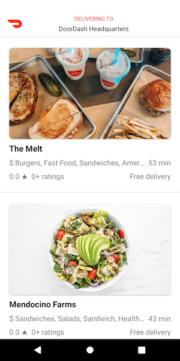
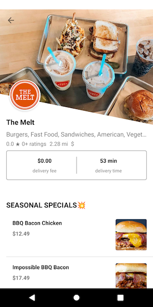

# DoorDash-Lite

A demo version of the DoorDash app.

Features implemented are:
1. Store List
2. Store Detail

## Code Style
The project code base follows a Clean Android approach.
1. Presentation layer - MVVM
2. Domain layer - UseCases
3. Data layer - Repository Design pattern.

## Libraries:
1. Android Architecture components
2. RxJava
3. Retrofit-OkHTTP-Gson
4. Android Room database
5. Glide - Image Loading library
6. JUnit - Mockito - MockWebServer

## Screenshots:

